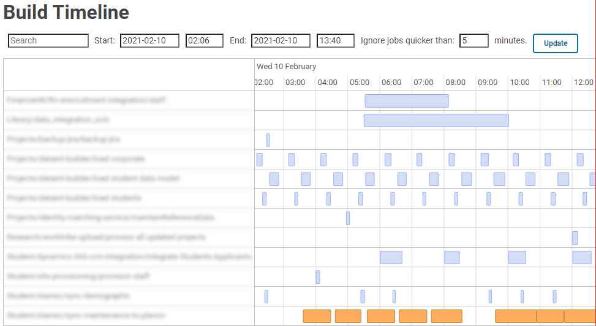

# Jenkins Build Timeline Plugin

This is a Jenkins plugin that adds a menu item to the home page, and
uses [VisJS Timeline](https://visjs.org/) to display builds
on a searcheable, scrollable and zoomable timeline.

This is an improvement on the built in build view, it is much easier
to filter and view builds.

This uses the following open source projects:

- [VisJS Timeline](https://visjs.org/)
- [MomentJS](https://momentjs.com/)
- [PikaDay](https://github.com/Pikaday/Pikaday)
- [Load Awesome](http://github.danielcardoso.net/load-awesome/)

